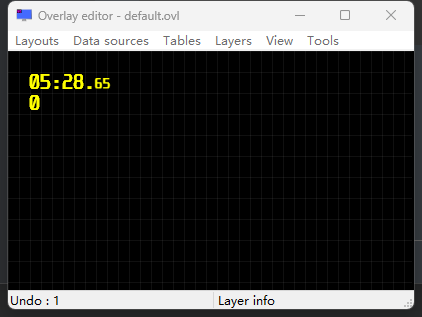
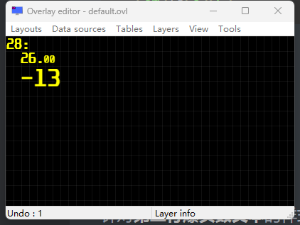
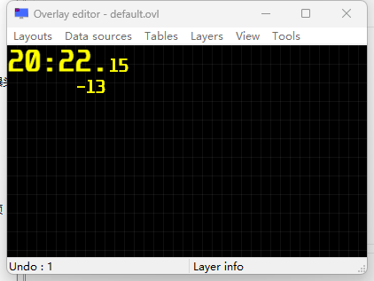

# RTSS Text Format Guide

## Example 1

For the **first line of the time text** style:

```html
<C0=FFFF00><P=10,10><S0=-70><C0>%1:%2.<S0>%3<S><C>
```



- `<C0=FFFF00>` defines a **color variable** `C[0]` with the value `0xFFFF00` (yellow). `<C0>` then sets the color of **subsequent text** to `C[0]`, resulting in yellow text. `<C>` at the end restores the color to the default (you can think of `C` as the default variable, and similarly, you could directly change the `C` variable’s color value as in `<C=FFFF00>`).
- `<P=10,10>` sets the **position** of **subsequent text** to `10, 10`, so the text isn’t positioned right at the top-left corner.
- `<S0=-70>` defines a size variable `S0` with a value of `-70`. `<S0>` sets the **text size** for subsequent text to the value of `S0`, i.e., `-70 (-70%)`. Therefore, we see the millisecond text is smaller than the minutes and seconds text. **Negative values indicate downward alignment, while positive values indicate upward alignment**. `<S>` restores the text size of subsequent text to the default size.
- `%1, %2, %3` are **placeholders** where the tool will insert the values for minutes, seconds, and milliseconds, respectively.

## Example 2

For the **first line of the time text** style:

```html
<C0=FFFF00><S0=-70><C0>%1:<P=10,10>%2.<S0>%3<S><C>
```



- Here, we set `<P=10,10>` after `%1:`, so the starting **position of the text following the minutes** is shifted to `10, 10`. Additionally, because **the headshot count text follows the time text**, it’s also affected by `<P=10,10>`, shifting it to the right by `10`.

## Example 3

For the **second line of headshot count text** style:

```html
<C0=FFFF00><A1=-10><C0><A1><C0>%1<C>
```



- `<A1=-10>` defines an **alignment** variable `A[1]` as right-aligned by `10` characters, which is then applied using `<A1>`. **Right alignment is indicated by a negative value, while left alignment requires no sign**. Here, `"-13"` has `10 - 3 = 7` spaces to its left, achieving **right alignment**. Since `<A1=-10>` is defined after the time text, the time text is unaffected.
- `%1` is a **placeholder** for the headshot count.