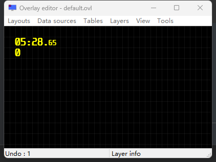
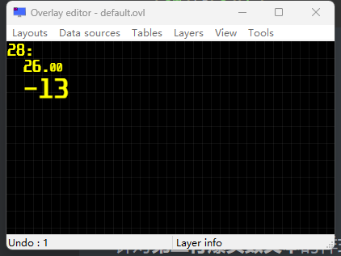

# RTSS 文本格式说明

## 例1

针对**第一行时间文本**的样式：

```html
<C0=FFFF00><P=10,10><S0=-70><C0>%1:%2.<S0>%3<S><C>
```



- `<C0=FFFF00>`表示定义一个**颜色变量**`C[0]`，其值为`0xFFFF00`（黄色），`<C0>`表示设置**其后续文本**的颜色都为`C[0]`，因此我们看到文本的颜色为黄色。最后的`<C>`表示还原颜色为默认颜色（你可以把`C`理解为默认的变量，同理，你也可以直接更改变量`C`的颜色值“`<C=FFFF00>`”）。
- `<P=10,10>`表示设置**其后续文本**的**位置**为`10, 10`，因此，我们可以看到文本并不是紧贴左上角的。
- `<S0=-70>`表示定义一个大小变量为`S0`，其值为`-70`。`<S0>`表示设置**其后续文本的大小**为`S0`变量的值，也就是`-70 (-70%)`，因此我们看到，毫秒的文本大小没有分和秒大。这里的**负数表示向下对齐，如果不加符号，则向上对齐**。同理，`<S>`表示恢复其后面的文本大小为默认大小。
- `%1, %2, %3`分别为**三个占位符**，工具会将分、秒、毫秒的值分别放置在这三个位置。

## 例2

针对**第一行时间文本**的样式：

```html
<C0=FFFF00><S0=-70><C0>%1:<P=10,10>%2.<S0>%3<S><C>
```



- 由于我们在`%1:`后面设置了`<P=10,10>`，因此分钟**后面文本**的起始位置移动到了`10, 10`处。并且我们发现，由于**爆头数文本是在时间后面**的，因此爆头数文本也受到了`<P=10,10>`的影响，即左侧向右移动了`10`。

## 例3

针对**第二行爆头数文本**的样式：

```html
<C0=FFFF00><A1=-10><C0><A1><C0>%1<C>
```


- `<A1=-10>`表示定义**对齐**变量`A[1]`为右对齐`10`个符号，然后通过`<A1>`应用了该对其方式。其中，**右对齐为负，左对齐不加符号**。我们可以看到，“`-13`”的左边多了`10 - 3 = 7`个空格，实现了文本**右对齐**。由于我们定义使用`<A1=-10>`在时间文本之后，因此时间文本不受影响。
- `%1`为一个**占位符**，用于放置爆头数。